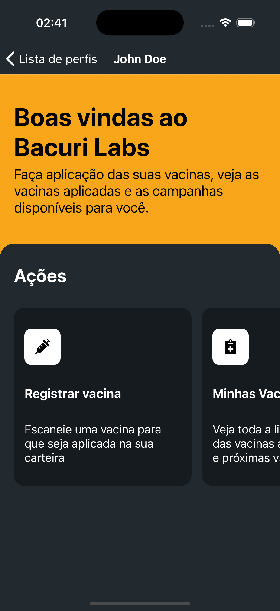
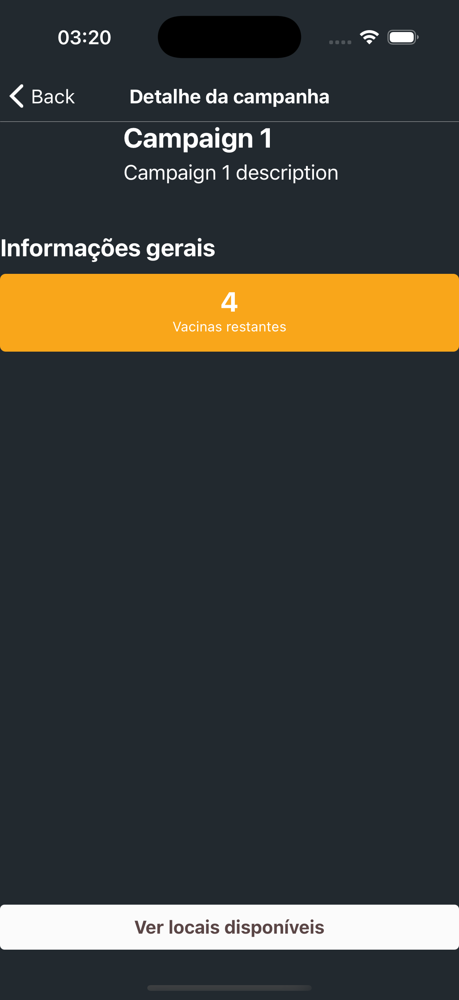

# 💉 Vaccine Tracker App

A simple and intuitive vaccine tracking app built with **React Native** and **Expo**.
Easily manage your family's vaccination records, scan vaccine QR codes and stay informed about local vaccination campaigns.

---

## 📱 Features

- 🔐 **Login & Sign Up**
  Create an account securely to manage your vaccination history.

- 👨‍👩‍👧‍👦 **Multiple Profiles**
  Add and manage profiles for each of your children under a single account.

- 📷 **Apply Vaccines via QR Code**
  Use your phone’s camera to scan the QR code from a vaccine card and automatically add it to the selected profile.

- 📋 **Vaccines Overview**
  View all available vaccines and check which ones have been applied for each profile.

- 📢 **Campaigns with Map**
  Explore active vaccination campaigns, view detailed information, and locate them on an interactive map.

---

## 🖼 Screenshots

### 🔐 Login / Sign Up


### 👧 Profile Management


### 📷 Profile Dashboard


### 📋 Campaign Details


### 🗺 Campaign Map


---

## 🧰 Tech Stack

- [React Native](https://reactnative.dev/)
- [Expo](https://expo.dev/)
- [React Navigation](https://reactnavigation.org/)
- [Expo Camera](https://docs.expo.dev/versions/latest/sdk/camera/)
- [Axios](https://axios-http.com/)
- [React Native Maps](https://github.com/react-native-maps/react-native-maps)

---

## 🛠 Setup

1. Clone the repo

```bash
git clone https://github.com/bacuri/bacuri.labs-app.git
cd bacuri.labs-app
```

2. Install dependencies

```bash
npm install
# or
yarn install
```

3. Run the project

```bash
npx expo start
```
